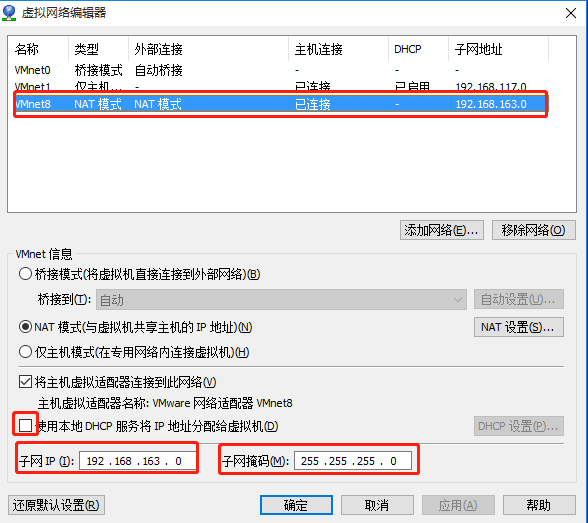
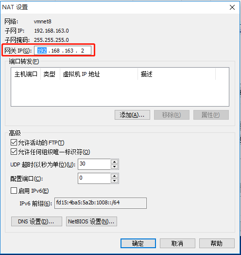
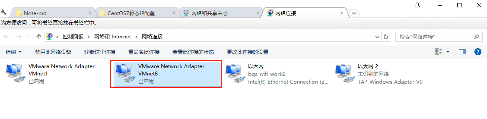
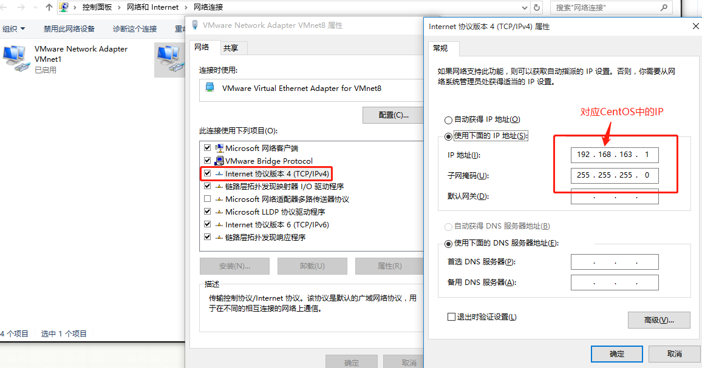

今天在VMware上搭建一个一台CentOS7服务器，下面将简单介绍如何配置CentOS静态IP。

## 0x01、配置网络连接为NAT模式<!-- more -->

##### 1、在VMware里，依次点击”编辑“ - ”虚拟网络编辑器“，如下图，我选择的是NAT模式：



##### 2、在这个界面接着点"NAT设置"，查看虚拟机的网关 。




## 0x02、配置ifcfg

##### 1、以root权限编辑/etc/sysconfig/network-scripts/ifcfg-en33

```
TYPE=Ethernet
PROXY_METHOD=none
BROWSER_ONLY=no
# 静态IP
BOOTPROTO=static
DEFROUTE=yes
IPV4_FAILURE_FATAL=no
IPV6INIT=yes
IPV6_AUTOCONF=yes
IPV6_DEFROUTE=yes
IPV6_FAILURE_FATAL=no
IPV6_ADDR_GEN_MODE=stable-privacy
NAME=ens33
UUID=192d8f57-4e75-4f33-8082-b23f00da582e
DEVICE=ens33
# 开机自动连接网络
ONBOOT=yes

# 固定的静态IP
IPADDR=192.168.163.66
# 对应步骤2中的网关
GATEWAY=192.168.163.2
# 子网掩码
NETMASK=255.255.255.0
# DNS1为Windows上对应的DNS
DNS1=192.168.1.1 
DNS2=114.114.114.114
```


### 0x03、解决windows不能ping通centos问题

##### 1、此时如果CentOS7能ping通外网和Windows，但Windows不能ping通CentOS7。需要执行以下配置。

- 关闭防火墙

```
CentOS7
查看防火墙状态：
firewall-cmd --state
停止防火墙
systemctl stop/start firewalld.service
禁止防火墙开机启动
systemctl disable/enable firewalld.service
开启端口
firewall-cmd --zone=public --add-port=80/tcp --perment
```

```
CentOS7以下
查看防火墙状态：
service iptables status
停止防火墙
service iptables stop/start
禁止防火墙开机启动
chkconfig iptables on/off

```

- 在windows主机的网络设置中选择VMNet8 



设置IP与CentOS中IP的网段对应

