使用IDEA搭建一个Maven聚合工程，整合ssm、log4j、junit、tomcat，后续整合Dubbo、Redis、ZK、kafka、shiro等框架做一个简单的Web系统。

[项目地址Github\BQSPro](https://github.com/DurianCoder/BQSPro)

<!-- more -->

## 0x01、配置Maven

#### 修改setting.xml:

##### 1）、添加阿里云镜像，解决maven下载速度慢的问题

```
	 <!-- 配置阿里云仓库 -->
	<mirror>
		<id>alimaven</id>
		<name>aliyun maven</name>
		<url>http://maven.aliyun.com/nexus/content/groups/public/</url>
		<mirrorOf>central</mirrorOf>        
	</mirror>
```

##### 2）、配置本地仓库

```
 <localRepository>F:\Maven\repository</localRepository>
```

##### 3）、IDEA配置好Maven仓库


## 0x02、创建Maven聚合工程

##### 1）、创建父工程：maven-quikstart  pom包

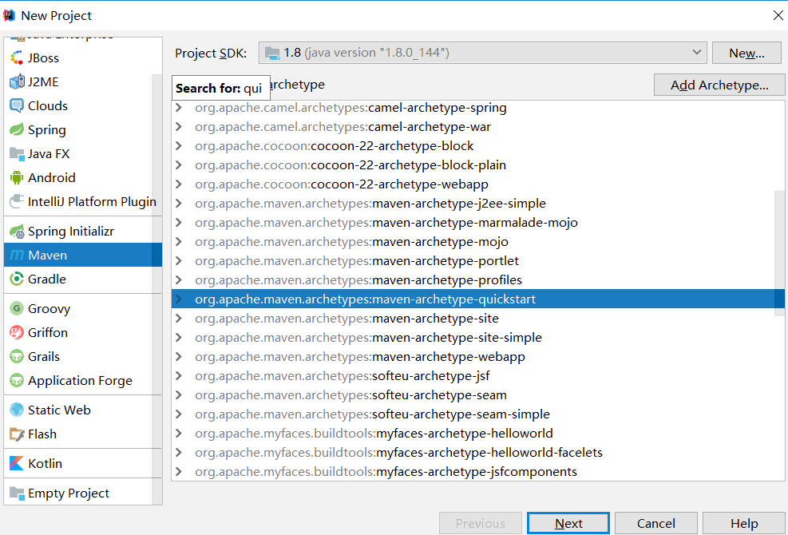

##### 2）、创建子模块module：Dao、Controller、Services   maven-quikstart jar包

右击project --->  new ---> Module  ---> quikstart

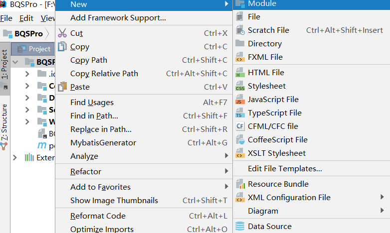

##### 3）、创建子模块module：Web   maven-webapp war包

右击project --->  new ---> Module  ---> wabapp

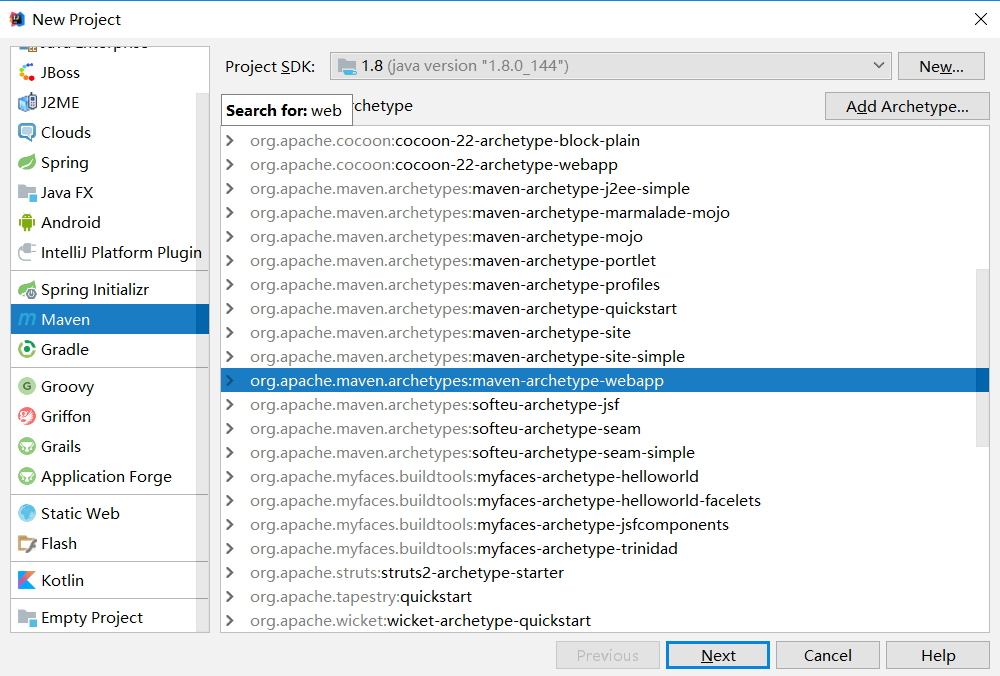

##### 4）、Maven聚合工程目录结构

把父工程的src删除

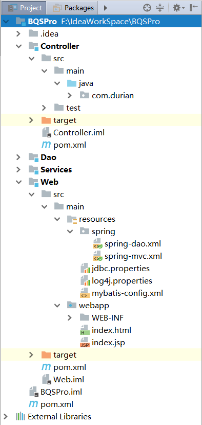

##### 5）、各级pom.xml

父工程pom.xml：打成pom包，添加各个module，在build中添加resources加载xml文件

##### 1）、打成pom包加载各个module

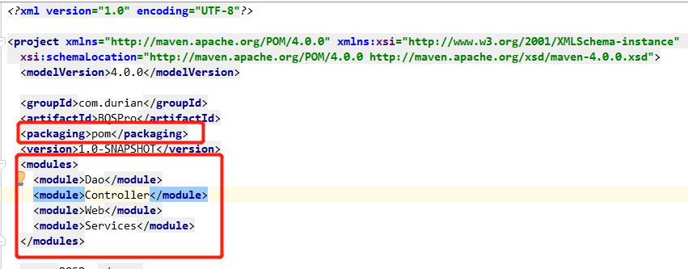

##### 2）、在build中添加resources加载xml文件

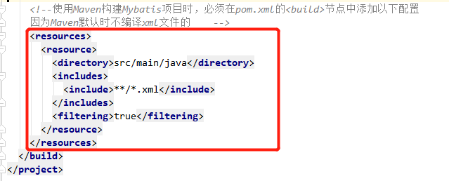

##### 3）、配置加载公共依赖：具体的Maven配置参考源码，github链接在文首给出。

##### 4）、各个Module之间相互引用：在pom中配置dependency

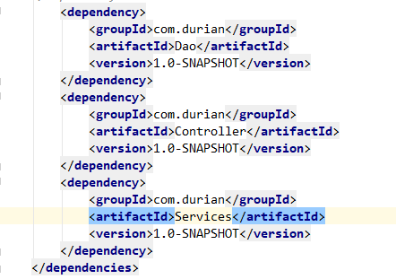


## 0x03、配置SSM

##### 1、配置web.xml

- 配置欢迎列表
- 配置springmvc-dispatchServlet
- 统一编码过滤器

```
<web-app xmlns="http://java.sun.com/xml/ns/javaee"
         xmlns:xsi="http://www.w3.org/2001/XMLSchema-instance"
         xsi:schemaLocation="http://java.sun.com/xml/ns/javaee
                      http://java.sun.com/xml/ns/javaee/web-app_3_0.xsd"
         version="3.0"
         metadata-complete="true">
    <!--使用maven创建的webapp需要将servlet版本改为3.0-->

    <!--配置欢迎页面列表-->
    <welcome-file-list>
        <welcome-file>index.jsp</welcome-file>
        <welcome-file>WEB-INF\view\index.html</welcome-file>
        <welcome-file>index.html</welcome-file>
    </welcome-file-list>

    <!--配置springmvc的dispatchServlet-->
    <servlet>
        <servlet-name>springmvc</servlet-name>
        <servlet-class>org.springframework.web.servlet.DispatcherServlet</servlet-class>
        <!--加载spring配置文件-->
        <init-param>
            <param-name>contextConfigLocation</param-name>
            <param-value>classpath:spring/spring-*.xml</param-value>
        </init-param>
        <load-on-startup>1</load-on-startup>
    </servlet>

    <!--拦截所有请求-->
    <servlet-mapping>
        <servlet-name>springmvc</servlet-name>
        <url-pattern>/</url-pattern>
    </servlet-mapping>

    <!--统一编码过滤器-->
    <!--/ 只拦截 "/xx" 不能拦截 "/xx.xx"-->
    <!--/* 则是拦截所有-->
    <filter>
        <filter-name>characterEncodingFilter</filter-name>
        <filter-class>org.springframework.web.filter.CharacterEncodingFilter</filter-class>
        <init-param>
            <param-name>encoding</param-name>
            <param-value>utf-8</param-value>
        </init-param>
    </filter>
    <filter-mapping>
        <filter-name>characterEncodingFilter</filter-name>
        <url-pattern>/*</url-pattern>
    </filter-mapping>

</web-app>
```

##### 2、配置jdbc.properties

```
jdbc.driver=com.mysql.jdbc.Driver
jdbc.username=***
jdbc.password=***
jdbc.url=jdbc:mysql://localhost:3306/seckill?useUnicode=true&characterEncoding=utf-8&useSSL=false
```

##### 3、配置log4j.properties

```
#配置扫描mybatis中的sql
log4j.logger.org.mybatis=TRACE
log4j.logger.com.durian.dao=TRACE

# 日志打印等级
log4j.rootLogger=INFO, stdout

log4j.appender.stdout=org.apache.log4j.ConsoleAppender
log4j.appender.stdout.layout=org.apache.log4j.PatternLayout
log4j.appender.stdout.layout.ConversionPattern=%d %p [%c] - %m%n

log4j.appender.logfile=org.apache.log4j.FileAppender
log4j.appender.logfile.File=target/spring.log
log4j.appender.logfile.layout=org.apache.log4j.PatternLayout
log4j.appender.logfile.layout.ConversionPattern=%d %p [%c] - %m%n
```

日志打印的使用：

```
@Controller
@RequestMapping("/bqs")
public class IndexController {

    Logger LOG = LogManager.getLogger(IndexController.class);

    @RequestMapping(value = {"/index" , "/"} , method = RequestMethod.GET)
    public ModelAndView index() throws  Exception {
        ModelAndView mav = new ModelAndView("index");
        LOG.info("this is index controller...");
        mav.addObject("message" , "hello, world!");
        return mav;
    }
```


##### 4、配置mybatis-config.xml

```
<?xml version="1.0" encoding="UTF-8" ?>
<!DOCTYPE configuration PUBLIC
        "-//mybatis.org//DTD MyBatis Generator Configuration 3.0//EN"
        "http://mybatis.org/dtd/mybatis-3-config.dtd" >
<configuration>
    <!--首先配置全局属性-->
    <settings>
        <!--开启自动填充主键功能，原理时通过jdbc的一个方法getGeneratekeys获取自增主键值-->
        <setting name="useGeneratedKeys" value="true"/>
        <!--使用别名替换列名，默认就是开启的-->
        <setting name="useColumnLabel" value="true"/>
        <!--开启驼峰命名的转换-->
        <setting name="mapUnderscoreToCamelCase" value="true"/>

    </settings>

</configuration>
```

##### 5、配置spring-dao.xml

```
<?xml version="1.0" encoding="UTF-8"?>
<beans xmlns="http://www.springframework.org/schema/beans"
       xmlns:xsi="http://www.w3.org/2001/XMLSchema-instance"
       xmlns:context="http://www.springframework.org/schema/context"
       xmlns:aop="http://www.springframework.org/schema/aop"
       xsi:schemaLocation="http://www.springframework.org/schema/beans
                           http://www.springframework.org/schema/beans/spring-beans.xsd
                           http://www.springframework.org/schema/context
                           http://www.springframework.org/schema/context/spring-context-3.0.xsd
                           http://www.springframework.org/schema/aop
                           http://www.springframework.org/schema/beans/spring-aop-3.0.xsd">

    <!--使用注解的方式依赖注入-->
    <context:annotation-config/>
    
    <!--自动包扫描-->
    <context:component-scan base-package="com.durian"/>
    
    <!--开启aop注解配置-->
    <!--<aop:aspectj-autoproxy/>-->


    <!--&lt;!&ndash;加载jdbc.properties    &ndash;&gt;-->
    <context:property-placeholder location="classpath:jdbc.properties"/>
    
    <!--配置数据源-->
    <bean id="dataSource" class="org.springframework.jdbc.datasource.DriverManagerDataSource">
        <property name="driverClassName">
            <value>${jdbc.driver}</value>
        </property>
        <property name="url">
            <value>${jdbc.url}</value>
        </property>
        <property name="username">
            <value>${jdbc.username}</value>
        </property>
        <property name="password">
            <value>${jdbc.password}</value>
        </property>
    </bean>
    
    <!--配置sessionFactory-->
    <bean id="sqlSession" class="org.mybatis.spring.SqlSessionFactoryBean">
        <!--引用dataSource-->
        <property name="dataSource" ref="dataSource"/>
        <!--扫描mapper.xml-->
        <!--<property name="mapperLocations" value="classpath:com/durian/mapper/*.xml"/>-->
        <!--配置mybatis全局配置-->
        <property name="configLocation" value="classpath:mybatis-config.xml"/>
        <!--配置entity包，别名-->
        <property name="typeAliasesPackage" value="com.durian.pojo"/>
    </bean>
    
    <!--开启事务-->
    <bean id="transactionManager" class="org.springframework.jdbc.datasource.DataSourceTransactionManager">
        <property name="dataSource" ref="dataSource" />
    </bean>

</beans>

```

##### 6、配置spring-mvc.xml

```
<?xml version="1.0" encoding="UTF-8"?>
<beans xmlns="http://www.springframework.org/schema/beans"
       xmlns:xsi="http://www.w3.org/2001/XMLSchema-instance"
       xsi:schemaLocation="http://www.springframework.org/schema/beans http://www.springframework.org/schema/beans/spring-beans.xsd">

    <!--配置视图解析器-->
    <bean class="org.springframework.web.servlet.view.InternalResourceViewResolver">
        <property name="viewClass" value="org.springframework.web.servlet.view.JstlView"/>
        <property name="prefix" value="/WEB-INF/jsp/"/>
        <property name="suffix" value=".jsp"/>
    </bean>

</beans>
```

##### 7、配置Mybatis Generator

1）、在source目录下添加generatorConfig.xml文件

**targetProject需要配置父工程下面的Source文件路径**

**配置需要生成的table**

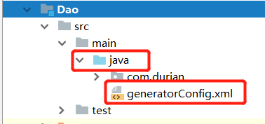

```
<?xml version="1.0" encoding="UTF-8"?>
<!DOCTYPE generatorConfiguration
  PUBLIC "-//mybatis.org//DTD MyBatis Generator Configuration 1.0//EN"
  "http://mybatis.org/dtd/mybatis-generator-config_1_0.dtd">
<generatorConfiguration>
    <!--数据库驱动-->
	<!--
		如果IDE(eclipse或者idea) 项目里导入了jar包，那么就不需要配置了jar包的绝对路径了
	     <classPathEntry    location="e:/project/mybatis/lib/mysql-connector-java-5.0.8-bin.jar"/> 
	-->
    <context id="DB2Tables"    targetRuntime="MyBatis3">
        <commentGenerator>
            <property name="suppressDate" value="true"/>
            <property name="suppressAllComments" value="false"/>
        </commentGenerator>

        <!--数据库链接地址账号密码-->
        <jdbcConnection driverClass="com.mysql.jdbc.Driver" connectionURL="jdbc:mysql://localhost/dababase_name" userId="username" password="pwd">
        </jdbcConnection>
        <javaTypeResolver>
            <property name="forceBigDecimals" value="false"/>
        </javaTypeResolver>

        <!--生成Model类存放位置，targetProject需要配置父工程下面的Source文件路径 -->
        <javaModelGenerator targetPackage="com.durian.pojo" targetProject="Dao\src\main\java">
            <property name="enableSubPackages" value="true"/>
            <property name="trimStrings" value="true"/>
        </javaModelGenerator>

        <!--生成映射文件存放位置-->
        <sqlMapGenerator targetPackage="com.durian.pojo" targetProject="Dao\src\main\java">
            <property name="enableSubPackages" value="true"/>
        </sqlMapGenerator>

        <!--生成Dao类存放位置-->
        <javaClientGenerator type="XMLMAPPER" targetPackage="com.durian.mapper" targetProject="Dao\src\main\java">
            <property name="enableSubPackages" value="true"/>
        </javaClientGenerator>

        <!--生成对应表及类名-->
        <table tableName="user" domainObjectName="User" enableCountByExample="false" enableUpdateByExample="false" enableDeleteByExample="false" enableSelectByExample="true" selectByExampleQueryId="false">
            <!--<property name="my.isgen.usekeys" value="true"/>-->
            <generatedKey column="id" sqlStatement="JDBC"/>
        </table>

    </context>
</generatorConfiguration>
```

2）、创建TestMybatisGenerator.java

```
package com.durian;
import org.mybatis.generator.api.MyBatisGenerator;
import org.mybatis.generator.config.Configuration;
import org.mybatis.generator.config.xml.ConfigurationParser;
import org.mybatis.generator.internal.DefaultShellCallback;
import java.io.InputStream;
import java.util.ArrayList;
import java.util.List;

public class TestMybatisGenerator {
	
    public static void main(String[] args) throws Exception {
        List<String> warnings = new ArrayList<String>();
        boolean overwrite = true;
        InputStream is= TestMybatisGenerator.class.getClassLoader().getResource("generatorConfig.xml").openStream();
        ConfigurationParser cp = new ConfigurationParser(warnings);
        Configuration config = cp.parseConfiguration(is);
        is.close();
        DefaultShellCallback callback = new DefaultShellCallback(overwrite);
        MyBatisGenerator myBatisGenerator = new MyBatisGenerator(config, callback, warnings);
        myBatisGenerator.generate(null);
        System.out.println("ok");
    }
}
```

8、SSM项目依赖

```
<dependencies>
    <dependency>
      <groupId>junit</groupId>
      <artifactId>junit</artifactId>
      <version>4.11</version>
      <scope>test</scope>
    </dependency>

    <dependency>
      <groupId>log4j</groupId>
      <artifactId>log4j</artifactId>
      <version>1.2.16</version>
    </dependency>

    <!-- 配置mysql连接驱动 -->
    <dependency>
      <groupId>mysql</groupId>
      <artifactId>mysql-connector-java</artifactId>
      <version>5.1.37</version>
    </dependency>

    <!--配置spring-->
    <dependency>
      <groupId>org.springframework</groupId>
      <artifactId>spring-context</artifactId>
      <version>4.1.3.RELEASE</version>
    </dependency>
    <dependency>
      <groupId>org.springframework</groupId>
      <artifactId>spring-core</artifactId>
      <version>4.1.3.RELEASE</version>
    </dependency>
    <dependency>
      <groupId>org.springframework</groupId>
      <artifactId>spring-test</artifactId>
      <version>4.1.3.RELEASE</version>
    </dependency>
    <dependency>
      <groupId>org.springframework</groupId>
      <artifactId>spring-aspects</artifactId>
      <version>4.1.3.RELEASE</version>
    </dependency>
    <dependency>
      <groupId>org.springframework</groupId>
      <artifactId>spring-tx</artifactId>
      <version>4.1.3.RELEASE</version>
    </dependency>
    <dependency>
      <groupId>org.springframework</groupId>
      <artifactId>spring-jdbc</artifactId>
      <version>4.1.3.RELEASE</version>
    </dependency>
    <dependency>
      <groupId>org.springframework</groupId>
      <artifactId>spring-web</artifactId>
      <version>4.1.3.RELEASE</version>
    </dependency>
    <dependency>
      <groupId>org.springframework</groupId>
      <artifactId>spring-webmvc</artifactId>
      <version>4.1.3.RELEASE</version>
    </dependency>
    <dependency>
      <groupId>org.springframework</groupId>
      <artifactId>spring-beans</artifactId>
      <version>4.1.3.RELEASE</version>
    </dependency>

    <!--配置mybatis-->
    <dependency>
      <groupId>org.mybatis</groupId>
      <artifactId>mybatis</artifactId>
      <version>3.3.0</version>
    </dependency>
    <dependency>
      <groupId>org.mybatis</groupId>
      <artifactId>mybatis-spring</artifactId>
      <version>1.3.0</version>
    </dependency>
    <dependency>
      <groupId>c3p0</groupId>
      <artifactId>c3p0</artifactId>
      <version>0.9.1.1</version>
    </dependency>
    <dependency>
      <groupId>com.github.pagehelper</groupId>
      <artifactId>pagehelper</artifactId>
      <version>3.4.2</version>
    </dependency>
    <dependency>
      <groupId>org.springframework</groupId>
      <artifactId>spring-aop</artifactId>
      <version>4.1.3.RELEASE</version>
    </dependency>

      <dependency>
          <groupId>org.mybatis.generator</groupId>
          <artifactId>mybatis-generator-core</artifactId>
          <version>RELEASE</version>
      </dependency>
    <!--配置web-->
    <dependency>
      <groupId>org.glassfish</groupId>
      <artifactId>javax.servlet</artifactId>
      <version>3.0.1</version>
    </dependency>
    <dependency>
      <groupId>jstl</groupId>
      <artifactId>jstl</artifactId>
      <version>1.2</version>
    </dependency>
    <dependency>
      <groupId>taglibs</groupId>
      <artifactId>standard</artifactId>
      <version>1.1.2</version>
    </dependency>

  </dependencies>
```


## 0x04、配置单元测试

##### 1）、配置生成Junit Test类的路径

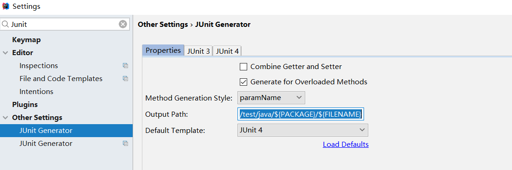

```
${SOURCEPATH}/../../test/java/${PACKAGE}/${FILENAME}
```

##### 2）、在需要测试的类中按快捷键 Ctrl + Shift + T，即可以自动生成测试类

```
package com.durian;
import org.junit.Test;
import org.junit.runner.RunWith;
import org.junit.runners.JUnit4;
import org.springframework.beans.factory.annotation.Autowired;
import org.springframework.test.context.ContextConfiguration;
import org.springframework.test.context.junit4.SpringJUnit4ClassRunner;
import static org.junit.Assert.*;

@RunWith(SpringJUnit4ClassRunner.class)
@ContextConfiguration(locations = {"classpath:spring/spring-dao.xml"})
public class DemoTest {
    @Autowired
    IndexService indexService;

    @Test
    public void say() throws Exception {
        indexService.sayHello();
    }
}
```


## 0x05、打包部署

##### 1、Maven打包

1）、方法一：直接打包

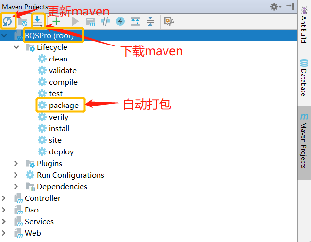

2）、方法二：配置打包命令，跳过测试打包：

- 新建一个package

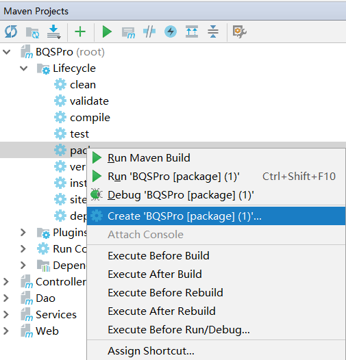

- 配置打包命令跳过测试

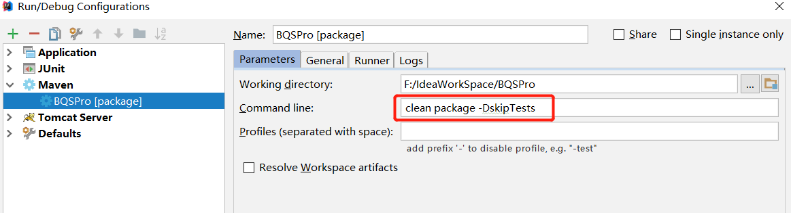

- 运行package


运行完会在WEB Module的target文件夹下生成一个对应的war包

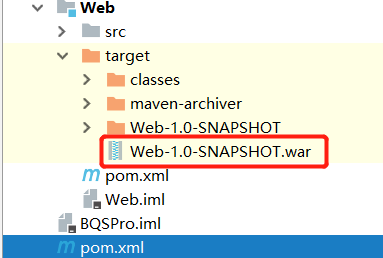

##### 2、部署项目到Tomcat

1）、配置tomcat

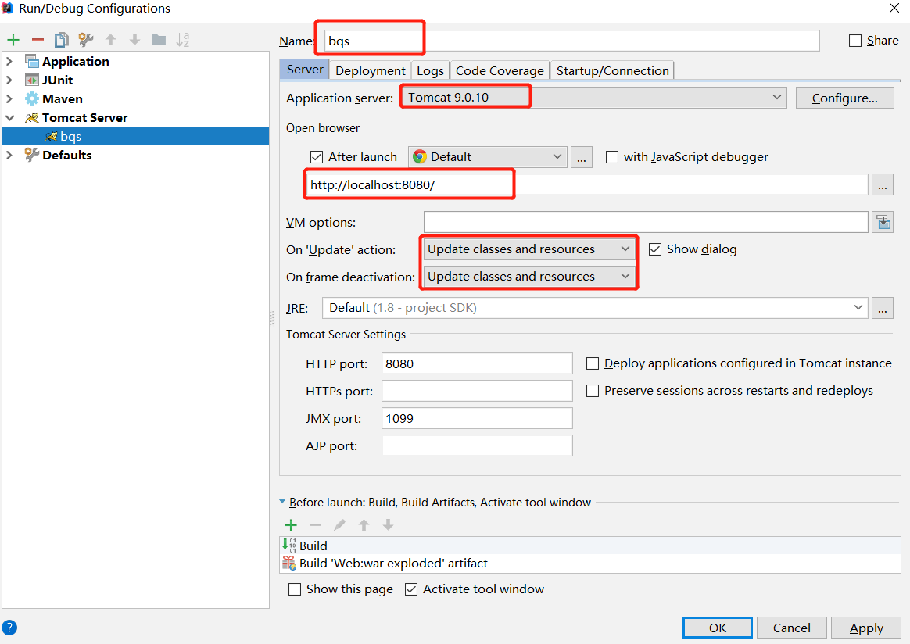

2）、部署，选中Deployment

- 点击+号选中第一个选项

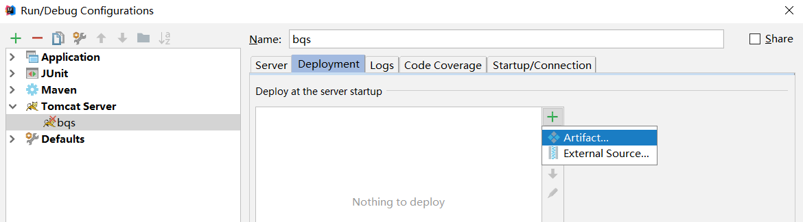

- 选中war exploded，点击OK

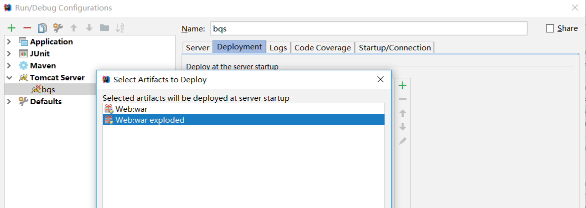

3）、运行tomcat


4）、浏览器访问：localhost:8080